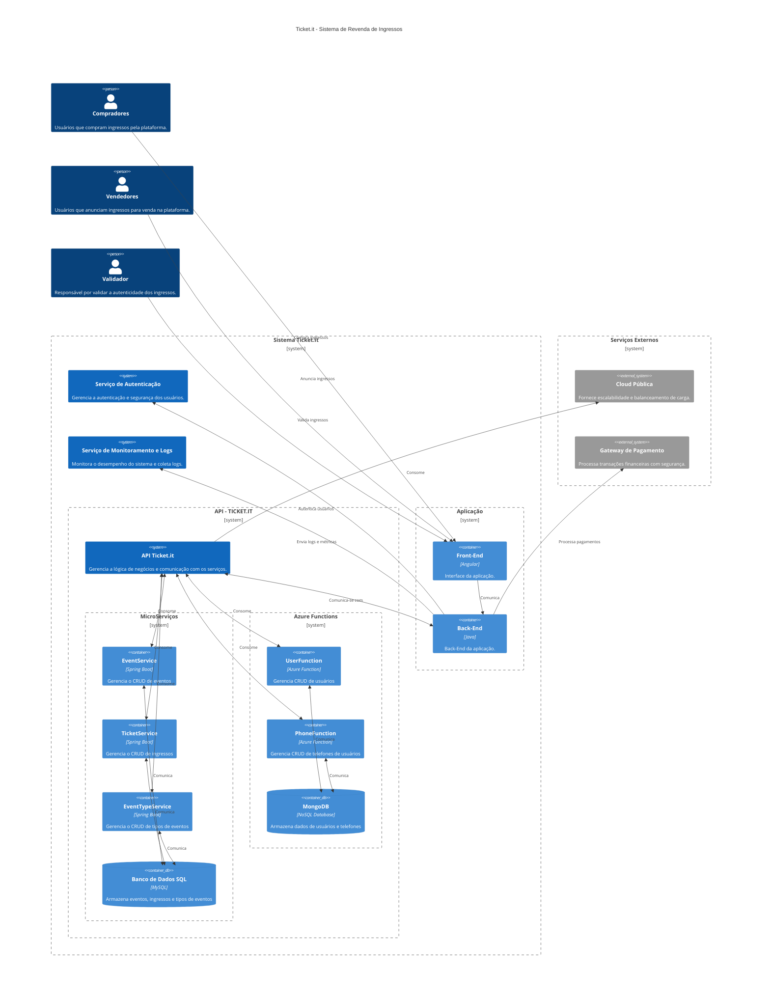

```mermaid
C4Context
  title Ticket.it - Sistema de Revenda de Ingressos

  Person(Compradores, "Compradores", "Usuários que compram ingressos pela plataforma.")
  Person(Vendedores, "Vendedores", "Usuários que anunciam ingressos para venda na plataforma.")
  Person(Validador, "Validador", "Responsável por validar a autenticidade dos ingressos.")

  Boundary(TicketItSystem, "Sistema Ticket.it") {
    Boundary(APITicket, "API - TICKET.IT") {
      System(API, "API Ticket.it", "Gerencia a lógica de negócios e comunicação com os serviços.")

      Boundary(MicroServicos, "MicroServiços"){
        Container(EventService, "EventService", "Spring Boot", "Gerencia o CRUD de eventos")
        Container(TicketService, "TicketService", "Spring Boot", "Gerencia o CRUD de ingressos")
        Container(EventTypeService, "EventTypeService", "Spring Boot", "Gerencia o CRUD de tipos de eventos")
        ContainerDb(SQLDatabase, "Banco de Dados SQL", "MySQL", "Armazena eventos, ingressos e tipos de eventos")
      }

      Boundary(AzureFunctions, "Azure Functions") {
        Container(UserFunction, "UserFunction", "Azure Function", "Gerencia CRUD de usuários")
        Container(PhoneFunction, "PhoneFunction", "Azure Function", "Gerencia CRUD de telefones de usuários")
        ContainerDb(MongoDB, "MongoDB", "NoSQL Database", "Armazena dados de usuários e telefones")
      }
    }

    Boundary(App, "Aplicação"){
      Container(Front, "Front-End", "Angular", "Interface da aplicação.")
      Container(Back, "Back-End", "Java", "Back-End da aplicação.")
    }      

    System(AuthService, "Serviço de Autenticação", "Gerencia a autenticação e segurança dos usuários.")
    System(MonitoringService, "Serviço de Monitoramento e Logs", "Monitora o desempenho do sistema e coleta logs.")    
  } 

  Boundary(ServicosExternos, "Serviços Externos"){
    System_Ext(CloudProvider, "Cloud Pública", "Fornece escalabilidade e balanceamento de carga.")
    System_Ext(PaymentGateway, "Gateway de Pagamento", "Processa transações financeiras com segurança.")
  }

  Rel(Compradores, Front, "Compra ingressos")
  Rel(Vendedores, Front, "Anuncia ingressos")
  Rel(Validador, Front, "Valida ingressos")

  Rel(Front, Back, "Comunica")

  BiRel(Back, API, "Comunica-se com")
  Rel(Back, AuthService, "Autentica usuários")
  Rel(Back, PaymentGateway, "Processa pagamentos")
  Rel(Back, MonitoringService, "Envia logs e métricas")
  
  Rel(API, CloudProvider, "Consome")
  BiRel(API, EventService, "Consome")
  BiRel(API, TicketService, "Consome")
  BiRel(API, EventTypeService, "Consome")
  BiRel(EventService, SQLDatabase, "Comunica")
  BiRel(TicketService, SQLDatabase, "Comunica")
  BiRel(EventTypeService, SQLDatabase, "Comunica")

  BiRel(API, UserFunction, "Consome")
  BiRel(API, PhoneFunction, "Consome")
  BiRel(UserFunction, MongoDB, "Comunica")
  BiRel(PhoneFunction, MongoDB, "Comunica")

  UpdateLayoutConfig($c4ShapeInRow="1", $c4BoundaryInRow="3")
```
