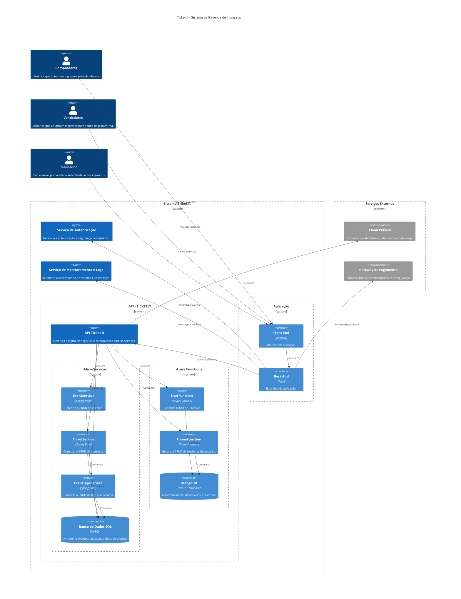

**TICKET.IT**

# 1 - Introdução e Metas

Este documento descreve a arquitetura do sistema Ticket.it, que é um marketplace para revendas de ingressos em Curitiba. Seu objetivo é fornecer uma visão geral da estrutura do sistema, facilitar a comunicação entre os stakeholders e servir como uma base para o desenvolvimento e manutenção do software.

## **1.1 - Visão Geral do Sistema**

### Modelo de Implantação Público

- Usaremos cloud pública para reduzir o custo de manutenção e necessidade de mão de obra especializada. Além disso, um sistema de balanceamento de carga para horários de pico seria facilmente solucionado com uma cloud pública, garantindo a disponibilidade.

- Outra vantagem para o uso da cloud pública seria a escalonabilidade, no início o sistema irá entrar em operação apenas na cidade de Curitiba, porém pretendemos aumentar a nossa área de serviço.

### Modelo de Serviço PaaS

- Para o modelo de serviço, a empresa decidiu implementar PaaS, pois a plataforma gerencia a infraestrutura subjacente, permitindo que a equipe de desenvolvimento se concentre no desenvolvimento do software, além disso, o PaaS oferece recursos de escalabilidade automática para lidar com os períodos de picos de uso.

## **1.2 Metas**

- Alta disponibilidade (24/7).

- Capacidade de escalabilidade em momentos de pico (elasticidade).

- Capacidade de manter diversas conexões simultâneas.

- Segurança das redes utilizadas.

- Servidor estar localizado no Brasil.

## **1.3 - Stakeholders**

### Equipe de Desenvolvimento

Responsabilidades:

- Desenvolvimento de Funcionalidades: Codifica e implementa as funcionalidades do software.
- Manutenção do Código: Corrige bugs, realiza atualizações e garante a estabilidade do software.
- Integração com Serviços: Configura e integra o software com os serviços de nuvem pública e terceiros.

Objetivos:

- Garantir que o software esteja funcional, eficiente e escalável.
- Contribuir para a criação de uma experiência de usuário fluida e envolvente.
- Manter o código limpo e bem documentado para facilitar a manutenção futura.

---

### Vendedores

Responsabilidades:

- Venda de Ingressos: Anunciar a revenda de ingressos na plataforma e fornecer descrições precisas e detalhadas dos ingressos disponíveis.
- Gestão de Transações: Monitorar e gerenciar as vendas de ingressos e responder a consultas e mensagens de compradores interessados.
- Atendimento ao Cliente: Oferecer suporte aos compradores e resolver problemas ou dúvidas que possam surgir.
- Feedback e Sugestões: Fornecer feedback sobre a plataforma e suas funcionalidades e reportar bugs e sugerir melhorias.

Objetivos:

- Listagem Eficiente de Ingressos: Anunciar ingressos de maneira clara e completa, garantindo que todas as informações estejam corretas e atualizadas.
- Gestão Eficaz das Vendas: Garantir que todas as transações sejam processadas corretamente e os pagamentos recebidos.
  -- Atendimento de Qualidade: Oferecer um suporte cordial e eficiente aos compradores.
- Contribuição para Melhoria: Contribuir com feedback construtivo para ajudar a melhorar a plataforma.

---

### Compradores

Responsabilidades:

- Compra de Ingressos: Buscar e adquirir ingressos disponíveis na plataforma, realizar pagamentos de forma segura e conforme os termos estabelecidos.
- Verificação e Acesso aos Ingressos: Confirmar as informações dos ingressos antes de finalizar a compra e garantir o recebimento e acesso adequado aos ingressos adquiridos.
- Feedback e Sugestões: Fornecer feedback sobre a experiência de compra e uso da plataforma, reportar problemas e sugerir melhorias.

Objetivos:

- Aquisição Segura e Eficiente: Encontrar e comprar ingressos que atendam às suas necessidades de forma segura e eficiente.
- Confirmação e Acesso Adequado: Confirmar as informações dos ingressos e garantir que eles estejam acessíveis para uso.
- Experiência Positiva de Compra: Oferecer feedback honesto para ajudar a melhorar a experiência de compra na plataforma.

---

### Validador

Responsabilidades:

- Verificação de Autenticidade: Conferir a autenticidade dos ingressos anunciados em anúncios premiuns na plataforma e garantir que os ingressos atendam aos critérios de validade e conformidade estabelecidos pela plataforma.
- Avaliação de Documentação: Revisar e validar a documentação fornecida pelos vendedores, incluindo comprovantes e detalhes dos ingressos.
- Confirmar a precisão das informações sobre os ingressos anunciados.
- Comunicação com Vendedores e Compradores: Interagir com vendedores para solicitar informações adicionais ou esclarecer dúvidas sobre a autenticidade dos ingressos.
- Informar os compradores sobre a validação dos ingressos, quando necessário.
- Feedback e Sugestões: Fornecer feedback sobre o processo de validação e sugerir melhorias para otimizar a verificação de autenticidade,
  reportar problemas ou inconsistências encontradas durante o processo de validação.

Objetivos:

- Garantia de Autenticidade: Assegurar que todos os ingressos anunciados em anúncios premiuns sejam autênticos e atendam aos padrões estabelecidos pela plataforma.
- Precisão na Validação: Validar corretamente a documentação e informações dos ingressos, garantindo que apenas ingressos legítimos sejam anunciados em anúncios pagos.
- Eficiência na Comunicação: Manter uma comunicação eficiente e clara com vendedores e compradores para resolver dúvidas e garantir a transparência no processo de validação.
- Contribuição para Melhoria do Processo: Oferecer feedback construtivo sobre o processo de validação e sugerir melhorias para aumentar a eficiência e a eficácia da verificação de autenticidade.

# 2 - Visão Geral de Restrições

## **2.1 Restrições Técnicas do Sistema**

- Plataforma de Hospedagem: Dependência de serviços de nuvem como AWS para garantir a escalabilidade, baixa latência, alta disponibilidade e desempenho.

- Escalabilidade e Desempenho: O sistema deve suportar picos de acesso conforme demanda e possuir baixa latência.

- Segurança e Criptografia: Implementação de criptografia em todas as transanções.

## **2.2 Restrições Organizacionais do Sistema**

- Prazos de Entrega: Prazo de entrega flexível, considerando que é uma startup.

- Orçamento Limitado: Restrições orçamentárias que limitam o uso de tecnologias ou serviços excessivamente caros, influenciando as escolhas arquiteturais.

- Capacitação da Equipe: Dependência das habilidades e do conhecimento técnico já existente nos trabalhadores, exigindo contratação de empregados que já dominem as tecnologias.

- Políticas Internas de Segurança: Conformidade com políticas internas de segurança da informação que podem restringir o uso de certas tecnologias ou práticas.

- Idioma: O sistema deve ser desenvolvido com interface em português.

## **2.3 Restrições Legais e Regulatórias do Sistema**

- Conformidade com a LGPD (Lei Geral de Proteção de Dados): Necessidade de aderir à LGPD, garantindo que todos os dados pessoais de usuários brasileiros sejam tratados com privacidade e segurança.

- Requisitos de Segurança de Pagamento (PCI-DSS): Conformidade com os padrões PCI-DSS para garantir a segurança nas transações financeiras e no armazenamento de informações de pagamento.

- Normas de Publicidade e Marketing: Conformidade com regulamentações que governam a publicidade digital, garantindo transparência e honestidade nas promoções e anúncios.

# 3 - Contexto do Sistema

O sistema é um site de revenda de ingressos online, com o principal foco em segurança nas transações para ambas as partes (vendedor e comprador). Utiliza um modelo de implantação público, e adota PaaS para gerenciar a infrestrutura subjacente, permitindo que a equipe foque 100% no desenvolvimento do projeto. O sistema visa garantir a alta disponibilidade, escalabilidade e segurança.

### Objetivos Principais:

- Alta Disponibilidade: Garantir que o sistema esteja acessível para os jogadores em todos os momentos.

- Escalabilidade: Adaptar-se a diferentes volumes de tráfego e picos de demanda de forma eficiente.

- Segurança: Proteger dados sensíveis e garantir a integridade e confidencialidade das informações dos usuários.

## **3.1 Contexto de Negócio**

A empresa busca desenvolver um sistema de revendas de ingressos online em que a segurança seja seu principal diferenciador.

### Stakeholders e Seus Interesses:

- Vendedores: Buscam revender seu(s) ingresso(s) de eventos na plataforma.

- Compradores: Buscam comprar ingresso(s) de eventos na plataforma.

- Validador: Responsável por validar ingressos que foram anunciados em anúncios pagos.

- Equipe de desenvolvimento: é responsável por criar, codificar e manter o software, garantindo que todas as funcionalidades estejam implementadas de acordo com os requisitos. Eles integram o sistema com a infraestrutura de nuvem, ajustam o código para garantir desempenho e escalabilidade. A equipe foca em entregar uma experiência de usuário estável, inovadora e livre de bugs, contribuindo diretamente para o sucesso do projeto.

### Requisitos de Negócio:

- Escalabilidade e Flexibilidade: Capacidade de ajustar recursos conforme a demanda para manter a performance e reduzir custos.

- Segurança de Dados: Proteção contra vazamentos e ataques previstos em cláusulas de contrato com a nuvem pública.

- Experiência do Usuário: Garantir uma experiência fluida e de fácil entendime na interface.

- Atratividade: Garantir segurança como principal imagem do nosso serviço.

## **3.2 Contexto Técnico**

### Modelo de Serviço PaaS (Platform as a Service):

- Gerencia a infraestrutura subjacente, permitindo que a equipe de desenvolvimento se concentre no desenvolvimento do sistema e aproveite a escalabilidade automática da plataforma.

### Landscape

- Jaeger: Rastrear transações de ponta a ponta no sistema de venda de tickets, identificando gargalos e melhorando a experiência do usuário.

- Envoy: Gerenciar o tráfego entre microserviços e fornecer recursos de segurança e observabilidade.

- Prometheus: Monitorar o desempenho do sistema de venda de tickets e a detectar problemas antes que afetem os usuários.

- Chaos Mesh: Simular falhas, definir e validar regras para quando falhas ocorrem e analisar o impacto de falhas.

- Kubernetes: Gerenciar contêineres em ambientes de produção devido à sua capacidade de automatizar e orquestrar tarefas complexas.

### Aspectos Técnicos:

- Alta Disponibilidade: Implementação de redundância e balanceamento de carga para garantir que o sistema esteja sempre disponível.

- Escalabilidade: Uso de cloud pública para lidar com picos de demanda e garantir uma experiência fluida.

### Infraestrutura e Integração:

- Infraestrutura: Cloud pública para diminuir custos e necessidade de mão de obra qualificada para o início do projeto.

- Integração: Conexão entre a plataforma de PaaS e os serviços de nuvem para suportar a operação contínua e escalável do sistema.

- Segurança: Implementação de medidas robustas de proteção de dados nas cláusulas de contrato e monitoramento contínuo para prevenir e responder a ameaças de segurança.

### Restrições Técnicas:

- Limitações de Custo: Gerenciar o orçamento dentro das limitações impostas pelo modelo de implantação público e PaaS.

- Complexidade da Integração: Desafios na integração entre diferentes serviços (pagamento e validação de tickets).

# 4. Solução

A arquitetura de solução do Ticket.it foi projetada para garantir uma revenda de ingressos online que seja ágil, segura e eficiente. Nossa abordagem considera a alta disponibilidade, escalabilidade e a integração com sistemas existentes, oferecendo uma experiência agradável tanto para compradores quanto para vendedores. Além disso, nosso sistema deve ser construído rapidamente, garantindo que não encontraremos muitos empecílios técnicos. A seguir, detalhamos a estrutura e os principais componentes da solução.

| Objetivo                             | Cenário                                                                                  | Solução                                                                                                               | Detalhes            |
| ------------------------------------ | ---------------------------------------------------------------------------------------- | --------------------------------------------------------------------------------------------------------------------- | ------------------- |
| Eficiência                           | Melhorar o desempenho e tempo de resposta dos microsserviços                             | Utilização de cache distribuído e otimizações nas consultas de banco de dados                                         | link aqui no futuro |
| Segurança                            | Proteger os dados da aplicação e garantir a integridade dos microsserviços               | Implementação de autenticação e autorização via OAuth 2.0, criptografia de dados e uso de firewalls de aplicação      | link aqui no futuro |
| Alta Disponibilidade                 | Manter a aplicação online por grande parte do tempo                                      | Utilização do Kubernets                                                                                               | link aqui no futuro |
| Escalabilidade                       | Manter várias instâncias da aplicação rodando simultaneamente                            | Containerização dos microsserviços e utilização de ferramentas como o Docker                                          | link aqui no futuro |
| Experiência Agradável para o usuário | Desenvolver aplicação que permite fluidez e contenha um design já popularmente agradável | Utilização do Angular Material, permitindo o desenvolviment da interface não apenas ágil mas consistente por toda ela | link aqui no futuro |
| Fácil construção                     | O sistema deve ser rapidamente construído                                                | Encontrar o framework cujo os desenvolvedores tenham maior experiência, sem comprometer os outros objetivos           | link aqui no futuro |

# 5. Vizualização Geral da Estrutura

A Visão de Implementação do Ticket.it descreve a abordagem detalhada para a construção e lançamento do sistema, garantindo que todos os componentes arquiteturais sejam implementados de forma eficaz e eficiente. A seguir, apresentamos o plano para a implementação, desde o ambiente de desenvolvimento até a implantação e monitoramento contínuo.

# 6. Vizualização da Execução

A Visão de Deployment do sistema Ticket.it descreve a abordagem para a implantação do sistema em produção, abordando a estratégia de lançamento, o processo de deploy e os mecanismos de operação e monitoramento contínuo. O objetivo é garantir uma transição suave do ambiente de desenvolvimento para o ambiente de produção, minimizando riscos, maximizando a eficiência e entregando continuamente.

# 7. Vizualização de Deployment

A Visão de Deployment descreve a infraestrutura técnica usada para executar o sistema Ticket.it e o mapeamento dos blocos de software para esses elementos de infraestrutura. A visão de deployment detalha como o sistema é distribuído em diferentes locais e ambientes, a estrutura física das conexões e a alocação dos componentes de software.

# 8. Conceitos Multicamadas

A Visão de Conceitos Multicamadas descreve a arquitetura em camadas do sistema Ticket.it, detalhando como diferentes camadas são organizadas para fornecer funcionalidades específicas e garantir a separação de preocupações. A arquitetura em camadas facilita a manutenção, escalabilidade e evolução do sistema, dividindo-o em componentes distintos que interagem entre si.

## 8.1 Modelo de domínio

# 9. Requisitos de Arquitetura

Os Requisitos de Arquitetura definem os princípios e restrições que orientam o desenvolvimento do sistema Ticket.it, garantindo que ele atenda aos objetivos de negócio e aos requisitos técnicos. Esses requisitos são essenciais para garantir a consistência, escalabilidade, segurança e flexibilidade da aplicação.

## 9.1 Arquitetura em Camadas

O sistema **Ticket.it** seguirá uma arquitetura em camadas, separando claramente as responsabilidades de cada componente do sistema. As camadas principais são:

- **Camada de Apresentação (Front-end)**: Responsável pela interface de usuário (UI) e pela experiência de usuário (UX). O front-end será desenvolvido utilizando Angular para garantir alta performance, consistência de interface e interatividade.
- **Camada de Aplicação (Back-end)**: Implementada em Spring Boot e Azure Functions, essa camada será responsável pela lógica de negócios e comunicação com os serviços de terceiros.
- **Camada de Persistência de Dados (Banco de Dados)**: Utilizaremos Azure SQL e MongoDB para armazenar dados transacionais, como informações de usuários e transações de ingressos. O banco de dados será gerido com controle de versão para garantir integridade.

## 9.2 Integração com Serviços Externos

O Ticket.it precisará se integrar com diversos serviços externos para garantir a funcionalidade do sistema. Isso inclui:

- **Gateways de pagamento**: Integração com serviço de pagamento externo **a definir** para processar transações financeiras de forma segura e eficiente.
- **APIs de terceiros**: O sistema poderá consumir APIs públicas e privadas, como APIs de validação de CPF e serviços de localização geográfica para recomendar eventos próximos ao usuário.

## 9.3 Segurança e Conformidade

A arquitetura do Ticket.it deve incorporar robustos mecanismos de segurança, garantindo a proteção dos dados e a conformidade com regulamentações locais e internacionais, como a LGPD. Alguns requisitos de segurança incluem:

- **Autenticação e Autorização**: Utilização de tokens JWT para autenticar e autorizar usuários.
- **Criptografia de Dados**: Implementação de SSL/TLS para garantir a criptografia de dados em trânsito.
- **Conformidade com PCI-DSS**: Implementação de padrões de segurança exigidos para o processamento de pagamentos.

## 9.4 Tolerância a Falhas

Para garantir alta disponibilidade, o sistema deve ser resiliente a falhas e estar preparado para recuperações automáticas. As estratégias incluem:

- **Replicação de Banco de Dados**: Implementação de replicação de dados entre servidores para garantir redundância e minimizar riscos de perda de dados.
- **Balanceamento de Carga**: Uso de Load Balancers para distribuir o tráfego entre várias instâncias da aplicação, garantindo alta disponibilidade e desempenho.

## 9.5 Escalabilidade

O sistema deve ser projetado para escalar horizontalmente de acordo com o aumento da demanda. Para isso:

- **Arquitetura baseada em Microserviços**: Cada componente do sistema deve ser modular e escalável de forma independente, permitindo flexibilidade na distribuição de cargas.
- **Containerização**: Utilizar Docker para garantir que os serviços sejam facilmente escaláveis e replicáveis em diferentes ambientes.
- **Cloud pública**: O uso de Microsoft Azure permitirá que o sistema escale dinamicamente em função da demanda, aproveitando serviços como Azure App Services, Azure Kubernetes Service (AKS) e Azure SQL Database e MongoDB para garantir escalabilidade e alta disponibilidade.

## 9.6 Manutenibilidade e Extensibilidade

O sistema Ticket.it deve ser facilmente mantido e extensível para permitir futuras evoluções e melhorias, com os seguintes princípios:

- **Modularidade**: O código será estruturado em módulos independentes, facilitando a manutenção e implementação de novas funcionalidades.
- **Testes Automatizados**: A arquitetura incluirá um ambiente de testes automatizados para garantir que futuras alterações no código não quebrem funcionalidades existentes.
- **Documentação Completa**: O sistema será completamente documentado, incluindo diagramas de arquitetura, fluxos de dados e APIs.

## 9.7 Desempenho

O sistema precisa atender a requisitos de alto desempenho para garantir uma boa experiência de usuário, especialmente em momentos de alta demanda:

- **Tempo de Resposta**: A aplicação deve ser capaz de processar requisições do usuário em menos de 3 segundos, garantindo fluidez na experiência de compra de ingressos.
- **Cache de Conteúdo**: Utilização de Redis para cache de consultas frequentes como usuários que revendem bastante vezes, diminuindo a carga sobre o banco de dados e aumentando a velocidade de resposta do sistema. Porém, não deve ser aplicada à busca de ingresso em si, pois pode gerar atrasos na exibição do ingresso após seu cadastro

## 9.8 Monitoramento e Logs

O sistema deverá possuir mecanismos robustos de monitoramento e geração de logs, que permitam identificar problemas em tempo real e garantir a estabilidade da aplicação:

- **Monitoramento de Saúde do Sistema**: Utilização de ferramentas como Prometheus para monitorar a saúde da aplicação, o uso de recursos e gerar alertas quando necessário.

## 9.9 Requisitos de Compatibilidade

O Ticket.it será projetado para ser compatível com uma ampla gama de navegadores, dispositivos e plataformas. Isso inclui:

- **Navegadores Compatíveis**: Suporte para Chrome, Firefox, Edge e Safari.
- **Dispositivos**: A aplicação será responsiva, garantindo uma experiência consistente tanto em desktops quanto em dispositivos móveis.

## 9.10 Padronização e Boas Práticas

Seguir padrões de desenvolvimento e boas práticas é essencial para garantir a qualidade e a manutenibilidade do sistema. Para isso, adotaremos:

- **Revisões de Código**: Implementação de um processo de revisão de código (code review) para garantir a qualidade do código.
- **Integração Contínua e Deploy Contínuo (CI/CD)**: O sistema deve contar com pipelines de CI/CD para automatizar testes, builds e deploys.

# 10. Requisitos de Qualidade

Os Requisitos de Qualidade definem as características desejáveis do sistema **Ticket.it** em termos de desempenho, confiabilidade, segurança e outros aspectos importantes para garantir uma experiência de usuário excelente e a operação eficiente do sistema. Esses requisitos são cruciais para o sucesso do projeto e devem ser monitorados e avaliados continuamente.

## 10.1 Desempenho

O sistema deve ser capaz de lidar com altos volumes de acessos simultâneos, mantendo a eficiência e a capacidade de resposta. Para isso, consideramos:

- **Tempo de resposta**: O tempo máximo de resposta para qualquer ação do usuário não deve ultrapassar 2 segundos, mesmo em momentos de alta demanda.
- **Capacidade de throughput**: O sistema deve ser capaz de processar inicialmente até 5000 transações por minuto em horários de pico (considerando nossa localização em Curitiba apenas), sem perda de desempenho.
- **Escalabilidade horizontal**: A infraestrutura deve permitir o aumento automático de instâncias para atender à demanda crescente de usuários.

## 10.2 Confiabilidade

O sistema deve ser robusto o suficiente para evitar falhas, e no caso de falhas, deve ser capaz de se recuperar rapidamente. Para isso, implementamos:

- **Alta disponibilidade**: O sistema deve estar disponível 99,9% do tempo, garantindo que usuários tenham acesso ininterrupto ao serviço.
- **Monitoramento ativo**: Ferramentas como Prometheus devem monitorar continuamente o desempenho, permitindo identificar e corrigir problemas rapidamente.
- **Backup contínuo**: Realizar backups automáticos e periódicos dos dados para garantir que não haja perda de informações importantes.

## 10.3 Segurança

A segurança é um dos principais pilares do sistema, garantindo a proteção dos dados pessoais e das transações financeiras dos usuários. Os requisitos de segurança incluem:

- **Autenticação e Autorização**: Implementação de autenticação de dois fatores para gerenciar o acesso de usuários e proteger os endpoints da API.
- **Criptografia de dados**: Todo o tráfego de dados entre o cliente e o servidor deve ser criptografado com SSL/TLS.
- **Políticas de privacidade**: Garantir conformidade com a LGPD para proteger dados pessoais dos usuários brasileiros.

## 10.4 Manutenibilidade

O sistema deve ser fácil de manter e evoluir conforme as necessidades de negócio e as mudanças tecnológicas. Para isso, os requisitos são:

- **Código limpo e modular**: Seguir princípios de Clean Code para garantir que o código seja fácil de ler, entender e modificar.
- **Testes automatizados**: Cobertura de código com testes unitários e de integração deve atingir pelo menos 80% em cada arquivo, minimizando a chance de erros em produção.
- **Documentação atualizada**: A documentação deve ser mantida atualizada, detalhando as funcionalidades do sistema e as instruções para manutenção.

## 10.5 Usabilidade

A experiência do usuário deve ser fluida e intuitiva, facilitando a navegação e o uso do sistema. Para garantir isso:

- **Design responsivo**: O sistema deve ser acessível de qualquer dispositivo, garantindo uma experiência agradável tanto em dispositivos móveis quanto em desktops.
- **Facilidade de navegação**: A interface deve ser projetada de forma intuitiva, com fluxos claros para compra, venda e validação de ingressos.
- **Feedback ao usuário**: O sistema deve fornecer feedback em tempo real sobre o status das ações, como confirmação de compra ou erros de processamento.

## 10.6 Compatibilidade

O sistema deve ser compatível com diferentes navegadores e dispositivos, garantindo o acesso de qualquer plataforma. Isso inclui:

- **Suporte a vários browsers**: Compatibilidade com os navegadores mais usados (Chrome, Firefox, Safari, Edge).
- **Suporte a dispositivos móveis**: O layout deve se ajustar a diferentes resoluções de tela, incluindo smartphones e tablets.
- **Integração com serviços de terceiros**: O sistema deve ser compatível com serviços externos, como gateways de pagamento e sistemas de autenticação via OAuth 2.0.

## 10.7 Escalabilidade

O Ticket.it deve ser capaz de escalar conforme a demanda. O uso de cloud pública oferece flexibilidade para aumentar os recursos de forma automatizada, garantindo que o sistema funcione bem sob cargas variáveis.

- **Aumento de capacidade**: O sistema deve ser capaz de escalar horizontalmente, criando novas instâncias conforme a demanda.

# 11. Riscos e Débito Técnico

O gerenciamento de riscos e a gestão do débito técnico são componentes críticos na arquitetura de sistemas, fundamentais para garantir a estabilidade, a eficiência e a evolução contínua do sistema Ticket.it. Este tópico aborda os principais riscos associados ao sistema, que podem impactar sua operação e sucesso, e o débito técnico, que se refere às deficiências e compromissos técnicos que podem afetar a qualidade e a manutenção do sistema.

Os seguintes riscos foram listados abaixo, assim como possíveis planos de mitigação

- Construção correta da pipeline: Nenhum dos membros do time possui experiência profissional com a construção de pipelines, portanto erros críticos podem ser cometidos durante sua construção. Como plano de contigência deve-se ter um contato de emergência de algum consultor de grande experiência para resolver eventuais problemas que aconteçam em produção.

- Sincronização das bases de dados: possuímos várias bases de dados e microsserviços diferentes, o que pode causar inconsistência nos dados se feita a integração de maneira incorreta. Como plano de contigência, podemos redobrar a atenção nossos testes de integração, impedindo erros que aconteçam e, caso aconteçam, sejam facilmente detectáveis e rapidamente corrigidos. Além disso, um log completo deve ser implementado de uma ponta a outra do sistema, permitindo debug ágeis.

### C4 Model (Até o Nível 3)

## Modelo Lógico

## LINKS

# GitHub
https://github.com/TiagoPaulin/ticket-microservice

# DockerHub
https://hub.docker.com/layers/gabrielfjess/ticket-microservice/latest/images/sha256:12c407e24fd61e58f86bd8ba6f734504d4b5bbb4f3cb99dabff0653bf5353b06?uuid=13474969-0C93-472D-BBEF-D665AE42D8E0

**EVIDÊNCIAS FUNCTIONS - TICKET.IT**

# CRUD USER

Fields:

{

    "name": "NOME DO USUÁRIO",

    "cpf": "CPF DO USUÁRIO",

    "birthDate": "DATA DE NASCIMENTO DO USUÁRIO",

    "email": "EMAIL DO USUÁRIO",

    "password": "SENHA DO USUÁRIO"

}

## CREATE (POST)

url: https://serverless-ticketit.azurewebsites.net/api/users?

body:

{

    "name": "Gabriel Felipe Jess Meira",

    "cpf": "132.456.089-42",

    "birthDate": "10/04/2004",

    "email": "gabrielfjmeira@gmail.com",

    "password": "senha123"

}

{

    "name": "Tiago Vieira Paulin",

    "cpf": "719.406.290-98",

    "birthDate": "12/11/2002",

    "email": "tiagovp@gmail.com",

    "password": "senha456"

}

{

    "name": "Brunno Tatsuo",

    "cpf": "225.757.220-39",

    "birthDate": "29/09/1992",

    "email": "brunnotatsuo@gmail.com",

    "password": "senha789"

}

## READ (GET)

url (get all): https://serverless-ticketit.azurewebsites.net/api/users?

url (get by id): https://serverless-ticketit.azurewebsites.net/api/users/{id}?

example: https://serverless-ticketit.azurewebsites.net/api/users/88864c19-2a10-4746-85a2-8f93e0af8f5b

## UPDATE (PUT)

url: https://serverless-ticketit.azurewebsites.net/api/users/{id}?

example: https://serverless-ticketit.azurewebsites.net/api/users/88864c19-2a10-4746-85a2-8f93e0af8f5b

body:

{

    "name": "Gabriel Felipe Jess Meira",

    "cpf": "132.456.089-42",

    "birthDate": "10/04/2004",

    "email": "gabrielfjmeira@gmail.com",

    "password": "123senha"

}

## DELETE (DELETE)

url: https://serverless-ticketit.azurewebsites.net/api/users/{id}?

example: https://serverless-ticketit.azurewebsites.net/api/users/77f69e12-c981-449b-a137-60081acd3b4f

# CRUD PHONE

Fields:

{

    "ddi": "DDI DO TELEFONE",

    "ddd": "DDD DO TELEFONE",

    "number": "NÚMERO DO TELEFONE",

    "user_id": "USUÁRIO DO TELEFONE"

}

## CREATE (POST)

url: https://serverless-ticketit.azurewebsites.net/api/phones_create_a_phone?

body:

{

    "ddi": "55",

    "ddd": "41",

    "number": "984961004",

    "user_id": "88864c19-2a10-4746-85a2-8f93e0af8f5b"

}

{

    "ddi": "55",

    "ddd": "41",

    "number": "984911345",

    "user_id": "29084ee4-d36e-47a0-90d5-69802eda8457"

}

## READ (GET)

url (get all): https://serverless-ticketit.azurewebsites.net/api/phones_get_phones

url (get by id): https://serverless-ticketit.azurewebsites.net/api/phones/{id}?

example: https://serverless-ticketit.azurewebsites.net/api/phones/dc54b00e-be8c-4653-b602-6c6c360205f3

## UPDATE (PUT)

url: https://serverless-ticketit.azurewebsites.net/api/phone/{id}?

example: https://serverless-ticketit.azurewebsites.net/api/phone/dc54b00e-be8c-4653-b602-6c6c360205f3

body:

{

    "ddi": "55",

    "ddd": "42",

    "number": "984961004",

    "user_id": "88864c19-2a10-4746-85a2-8f93e0af8f5b"

}

## DELETE (DELETE)

url: https://serverless-ticketit.azurewebsites.net/api/phones/{id}?

example: https://serverless-ticketit.azurewebsites.net/api/phones/009204b4-c6ec-49d7-b0d9-49d2f2c73bb6
